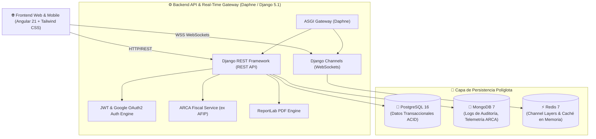

# FCC_APP - Sistema de Gestión Comercial y Operativa para Talleres Mecánicos

Plataforma web integral de arquitectura modular diseñada para digitalizar de punta a punta la administración operativa, el control de órdenes de trabajo (OT) y la gestión comercial/fiscal de talleres mecánicos automotrices. Desarrollado por estudiantes de la Tecnicatura Superior en Desarrollo de Software (TSDS) - ISPC, 2026.

---

## 🏗️ Arquitectura del Sistema

El ecosistema de **FCC_APP** implementa una arquitectura orientada a servicios con persistencia políglota (**Polyglot Persistence**) y comunicación bidireccional en tiempo real mediante WebSockets:



---

## 🛠️ Prerrequisitos de Instalación

| Herramienta | Versión Recomendada | Propósito |
| :--- | :--- | :--- |
| **Docker Engine & Compose** | `20.10.x` / `2.x+` | Despliegue orquestado de microservicios y bases de datos |
| **Python** | `3.12.x` o `3.13.x` | Intérprete para Backend Django REST y Daphne ASGI |
| **Node.js & npm** | `22.x.x` (LTS) / npm `10.x+` | Entorno de compilación y ejecución de Angular 21 |
| **PostgreSQL** | `16.x` | Base de datos relacional principal (en ejecución local sin Docker) |
| **MongoDB** | `7.x` | Base de datos NoSQL de documentos para auditoría y logs |
| **Redis** | `7.x` | Message broker para Django Channels y caché |

---

## 🚀 Guía de Inicialización

### 1. Clonar el repositorio
```bash
git clone https://github.com/TeamYear3/FCC_APP.git
cd FCC_APP
```

### 2. Configurar las Variables de Entorno
Copia la plantilla `.env.example` a `.env` y ajusta las credenciales locales:
```bash
# En Linux/macOS
cp .env.example .env

# En Windows PowerShell
Copy-Item .env.example .env
```

---

### Opción A: Despliegue Automatizado con Docker (Recomendado para Evaluación Integral)

Levanta todos los servicios (Django REST, Daphne ASGI, Angular, PostgreSQL, MongoDB y Redis) con un único comando:

```bash
# Compilar y levantar todos los contenedores en segundo plano
docker compose up --build -d

# Ver los logs del backend y frontend
docker compose logs -f backend frontend
```

Para aplicar migraciones y cargar datos de prueba dentro del contenedor:
```bash
# Aplicar migraciones
docker compose exec backend python manage.py migrate

# Detener el entorno liberando recursos
docker compose down
```

---

### Opción B: Ejecución Local Nativa (Sin Docker - Desarrollo Ágil)

#### 1. Configurar y Levantar el Backend (Django / Python)
```bash
cd backend

# Crear entorno virtual de Python
python -m venv .venv

# Activar entorno virtual
# En Windows:
.venv\Scripts\activate
# En Linux/macOS:
source .venv/bin/activate

# Instalar dependencias de desarrollo
pip install -r requirements/development.txt

# Aplicar migraciones a la base de datos local
python manage.py migrate

# Iniciar servidor de desarrollo con soporte ASGI y WebSockets
python manage.py runserver 0.0.0.0:8000
```

#### 2. Configurar y Levantar el Frontend (Angular 21)
```bash
cd frontend

# Instalar paquetes npm
npm install

# Iniciar servidor de desarrollo de Angular con Hot-Reload
npm start
```

El cliente web quedará disponible en `http://localhost:4200`.

---

## 🗺️ Mapeo de Puertos y Servicios

| Servicio | Puerto Local | URL de Acceso | Descripción |
| :--- | :---: | :--- | :--- |
| **Frontend (Angular)** | `4200` | [http://localhost:4200](http://localhost:4200) | Interfaz web responsiva y optimizada para taller |
| **Backend REST API** | `8000` | [http://localhost:8000/api/](http://localhost:8000/api/) | Endpoints REST de la API de backend |
| **Django Admin** | `8000` | [http://localhost:8000/admin/](http://localhost:8000/admin/) | Consola de administración y gestión de modelos |
| **PostgreSQL** | `5432` | `localhost:5432` | Base de datos relacional (usuarios, OTs, vehículos) |
| **MongoDB** | `27017` | `localhost:27017` | Almacenamiento NoSQL de logs y auditoría |
| **Redis** | `6379` | `localhost:6379` | Message broker para WebSockets y caché |

---

## 🔑 Usuarios de Prueba y Credenciales Preconfiguradas

El sistema cuenta con tres perfiles de usuario preconfigurados con permisos diferenciados:

| Rol | Correo Electrónico | Contraseña | Alcance y Vistas Asignadas |
| :--- | :--- | :--- | :--- |
| **Administrador** | `admin@fcc.com` | `admin123` | Control total del taller: Dashboard general, ABM Clientes y Vehículos, Facturación ARCA, Confección de OTs, Agenda de Turnos y Gestión de Usuarios. |
| **Técnico / Mecánico** | `tecnico@fcc.com` | `tecnico123` | Operativa de taller: Consulta y avance de OTs en proceso, checklist técnico, carga de mano de obra y repuestos, galería de fotos de diagnóstico y vista de turnos en modo lectura. |
| **Cliente** | `cliente@fcc.com` | `cliente123` | Portal de autogestión: Visualización del estado en tiempo real del vehículo, historial de servicios, consulta y aprobación online de presupuestos, y descarga de comprobantes PDF. |

---

## 📚 Catálogo de Endpoints REST y WebSockets

### 🔐 Autenticación y Perfil (`/api/auth/`)
- `POST /api/auth/login/` - Inicio de sesión tradicional (emisión de tokens JWT access/refresh).
- `POST /api/auth/token/refresh/` - Renovación de token de acceso JWT.
- `POST /api/auth/google/` - Autenticación federada con Google OAuth2.
- `GET /api/auth/perfil/` - Obtener datos del perfil del usuario autenticado.
- `PATCH /api/auth/perfil/` - Actualizar información del perfil y preferencias.

### 👥 Clientes y Legajos (`/api/clientes/`)
- `GET /api/clientes/` - Listado de clientes con filtros por nombre, DNI/CUIT y paginación.
- `POST /api/clientes/` - Alta de nuevo cliente.
- `GET /api/clientes/<id>/` - Detalle y legajo histórico del cliente.
- `PUT/PATCH /api/clientes/<id>/` - Modificación de datos del cliente.
- `DELETE /api/clientes/<id>/` - Baja lógica del cliente.

### 🚗 Vehículos (`/api/vehiculos/`)
- `GET /api/vehiculos/` - Listado general de vehículos vinculados a clientes.
- `POST /api/vehiculos/` - Registro de nuevo vehículo con validación de patente.
- `GET /api/vehiculos/<id>/` - Ficha técnica e historial de reparaciones del vehículo.
- `PUT/PATCH /api/vehiculos/<id>/` - Modificación de datos del vehículo.

### 📋 Órdenes de Trabajo y Presupuestos (`/api/ordenes/`)
- `GET /api/ordenes/` - Listado de órdenes de trabajo con filtros avanzados (estado, fecha, complejidad, patente).
- `POST /api/ordenes/` - Creación de nueva orden de trabajo con checklist inicial.
- `GET /api/ordenes/<id>/` - Expediente operativo completo de la OT.
- `PATCH /api/ordenes/<id>/` - Actualización de estado operativo (ingresado, en_proceso, en_pausa, finalizado, entregado).
- `POST /api/ordenes/<id>/presupuesto/` - Registro y actualización de ítems de presupuesto (mano de obra y repuestos).
- `POST /api/ordenes/<id>/aprobar/` - Aprobación del presupuesto por parte del cliente (presencial, llamada, WhatsApp).
- `POST /api/ordenes/<id>/cobro/` - Registro de cobro operativo (efectivo, transferencia, tarjeta).
- `GET /api/ordenes/<id>/pdf/` - Generación y descarga dinámica del comprobante PDF de la OT.
- `POST /api/ordenes/<id>/adjuntos/` - Carga de fotos de evidencia mecánica y diagnóstico.
- `DELETE /api/ordenes/adjuntos/<id>/` - Eliminación de evidencia fotográfica.

### 🗓️ Agenda y Turnos (`/api/turnos/`)
- `GET /api/turnos/` - Consulta de turnos agendados en el taller para FullCalendar.
- `POST /api/turnos/` - Agendamiento de nuevo turno con validación de cupo diario (máximo 2 por defecto, con opción de sobre-cupo forzado).
- `PUT/PATCH /api/turnos/<id>/` - Reprogramación y cambio de estado de turnos.
- `DELETE /api/turnos/<id>/` - Cancelación y eliminación física del turno.

### 🧾 Facturación y ARCA (`/api/facturacion/`)
- `GET /api/facturacion/` - Listado de comprobantes y estado fiscal.
- `POST /api/facturacion/emitir/` - Emisión de Factura Electrónica sincronizada con la API de ARCA (ex AFIP).
- `GET /api/facturacion/<id>/comprobante/` - Descarga de comprobante fiscal.

### ⚡ Canales de Tiempo Real (WebSockets)
- `ws://localhost:8000/ws/notificaciones/` - Canal de eventos y notificaciones push en vivo para actualización instantánea de estados de OT, fotos de diagnóstico y alertas de cupo en taller.

---

## 🧪 Ejecución de Pruebas Unitarias

### Backend (Django REST Test Suite)
```bash
# Ejecutar todas las pruebas unitarias del backend
python manage.py test --settings=config.settings.test

# Ejecutar pruebas de un módulo específico (ej. órdenes)
python manage.py test ordenes --settings=config.settings.test
```

### Frontend (Angular Test Suite con Vitest)
```bash
cd frontend

# Ejecutar suite de pruebas unitarias en modo headless (una sola corrida)
npm test -- --watch=false

# Validar compilación de producción de Angular
npm run build
```

---

## 🍃 Justificación Técnica de Persistencia NoSQL (MongoDB)

Dentro de la arquitectura de **FCC_APP**, el modelo de datos utiliza un enfoque híbrido de persistencia (**Polyglot Persistence**) para garantizar alto rendimiento, escalabilidad y estricta separación de responsabilidades:

1. **PostgreSQL (Base Relacional Principal):** Administra las entidades transaccionales ACID principales (`Usuarios`, `Clientes`, `Vehiculos`, `OrdenesDeTrabajo`, `Presupuestos`, `Facturas`).
2. **MongoDB (Base NoSQL de Documentos):** Se encarga del almacenamiento de datos no estructurados, eventos de alto volumen y registros de trazabilidad cronológica:
   - **`audit_logs` (Historial de Trazabilidad de OTs):** Registro inmutable tipo *append-only* de cada cambio de estado, diagnóstico técnico y movimiento de repuestos en los expedientes de taller.
   - **`arca_error_logs` (Telemetría tributaria de ARCA):** Payload JSON estructurado con las respuestas, excepciones y tokens de autenticación devueltos por la API de ARCA para auditar rechazos o inconsistencias de facturación fiscal.
   - **`websocket_events` (Historial de Eventos en Tiempo Real):** Registro de mensajería y notificaciones push transmitidas mediante Django Channels / Daphne entre Administradores y Técnicos en taller.

---

## 👥 Equipo de Desarrollo - ISPC TSDS 2026

Proyecto integrador desarrollado en el marco de la **Tecnicatura Superior en Desarrollo de Software (TSDS)** del **Instituto Superior Politécnico Córdoba (ISPC)**.
